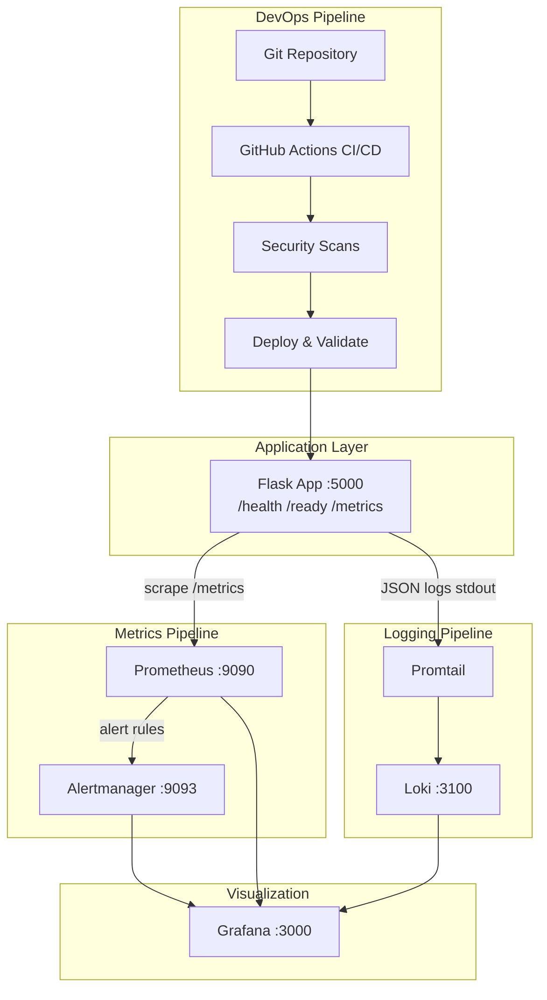
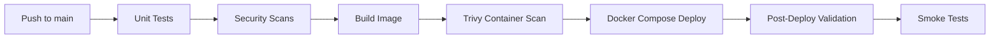
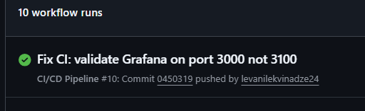

# DevOps Final Project — Observability Lab

A production-oriented DevOps stack built on the semester's assignments: a containerized Python application with **CI/CD**, **security automation**, **monitoring**, **logging**, **alerting**, and **reliability** tooling. The full environment starts with a single command and runs entirely locally via Docker Compose (no paid cloud services required).

**Repository:** https://github.com/levanilekvinadze24/devops-observability-lab

**Prior assignments integrated:**
- [DevOps Assignment 1](https://github.com/levanilekvinadze24/DevOps-Assigment1) — CI/CD foundations, automated testing
- [DevOps Midterm](https://github.com/levanilekvinadze24/DevOps-Midterm) — deployment automation, health monitoring
- [Observability Lab](https://github.com/levanilekvinadze24/devops-observability-lab) — Prometheus, Grafana, Loki, Alertmanager

---

## Quick Start (Single Command)

**Prerequisites:** Docker Desktop with Docker Compose v2.

### Windows (PowerShell)

```powershell
.\scripts\setup.ps1
```

### Linux / macOS

```bash
chmod +x scripts/*.sh
./scripts/setup.sh
```

This script copies `.env.example` → `.env`, builds all containers, starts the stack, and runs automated validation.

| Service       | URL                              | Credentials   |
|---------------|----------------------------------|---------------|
| Application   | http://localhost:5000            | —             |
| Prometheus    | http://localhost:9090            | —             |
| Grafana       | http://localhost:3000            | admin / admin |
| Alertmanager  | http://localhost:9093            | —             |
| Loki          | http://localhost:3100            | —             |

Verify manually:

```bash
curl http://localhost:5000/health
curl http://localhost:5000/ready
curl http://localhost:5000/metrics
```

Stop the stack:

```bash
docker compose down
```

---

## Project Architecture



**Components:**

| Layer | Tool | Purpose |
|-------|------|---------|
| Application | Flask + Gunicorn | Instrumented API with Prometheus metrics and JSON logging |
| CI/CD | GitHub Actions | Test → security scan → build → container scan → deploy & verify |
| Metrics | Prometheus | Scrapes `/metrics`, evaluates alert rules and SLOs |
| Logs | Loki + Promtail | Collects structured JSON logs from Docker containers |
| Dashboards | Grafana | Pre-provisioned dashboards, datasources, and alert rules |
| Alerting | Alertmanager | Routes critical/warning alerts by severity |
| IaC | Docker Compose | Declarative multi-service stack with health checks |

---

## Branching Strategy

| Branch | Purpose | CI/CD |
|--------|---------|-------|
| `main` | Production-ready code | Full pipeline + automated deploy verification |
| `develop` | Integration branch | CI + security scans (no deploy) |
| `feature/*` | New features | CI on pull request to `main` |

Workflow: feature branches → PR to `main` → CI must pass (tests + security) → merge triggers CD validation.

---

## Deployment Workflow



### Local deployment

```bash
./scripts/deploy.sh          # Linux/macOS
.\scripts\deploy.ps1         # Windows
```

Deploy rebuilds the app container, restarts it, saves a rollback reference, and runs validation.

### Rollback

```bash
./scripts/rollback.sh        # Linux/macOS
.\scripts\rollback.ps1       # Windows
```

See [docs/INCIDENT_RESPONSE.md](docs/INCIDENT_RESPONSE.md) for the full recovery runbook.

---

## Environment Setup

1. Clone the repository
2. Ensure Docker Desktop is running
3. Run `scripts/setup.ps1` (Windows) or `scripts/setup.sh` (Linux/macOS)
4. Optional: edit `.env` (created from `.env.example`) to customize ports and credentials

**Validation:**

```bash
./scripts/validate-environment.sh
```

**Continuous health monitoring:**

```bash
./scripts/health-monitor.sh    # polls /health and /ready every 30s
```

---

## Security Implementation

Security checks are integrated into the CI/CD pipeline (`.github/workflows/ci-cd.yml`):

| Check | Tool | Scope |
|-------|------|-------|
| Secrets scanning | Gitleaks | Entire repository |
| Dependency vulnerabilities | pip-audit | `app/requirements.txt` |
| Dockerfile lint | Hadolint | `app/Dockerfile` |
| Compose validation | `docker compose config` | Infrastructure config |
| IaC security | Checkov | Dockerfile + Docker Compose |
| Container image scan | Trivy | Built application image (CRITICAL/HIGH) |

**Additional hardening:**

- Application runs as non-root user (`appuser`) in the container
- Secrets managed via `.env` file (gitignored); template in `.env.example`
- Grafana signup disabled; admin credentials via environment variables
- Read-only volume mounts for Prometheus, Alertmanager, and Grafana provisioning

Run security checks locally:

```bash
make security    # requires pip-audit installed
make lint        # Dockerfile lint via Hadolint container
```

---

## Monitoring, Logging & Alerting

### Metrics (Prometheus + Grafana)

- `app_requests_total` — counter by method, endpoint, status
- `app_errors_total` — counter by error type
- Pre-provisioned Grafana dashboard: **Observability Lab - Application Metrics**

### Logs (Loki + Promtail)

Structured JSON logs with fields: `timestamp`, `level`, `message`, `service`, `duration_ms`.

LogQL example:

```logql
{container="observability-lab-app"} | json | level="ERROR"
```

### Alert rules

| Alert | Severity | Condition |
|-------|----------|-----------|
| `HighApplicationErrorRate` | critical | >5 errors/min for 1 min |
| `ApplicationDown` | critical | Prometheus scrape target down |
| `HighErrorRateWarning` | warning | >10 errors in 5 min |
| `SLOAvailabilityBreach` | warning | Success rate <99% for 5 min |

Trigger the critical alert:

```bash
./scripts/trigger-alert.sh
# or
curl "http://localhost:5000/api/error/bulk?count=10"
```

Verify at:
- Prometheus: http://localhost:9090/alerts
- Grafana: http://localhost:3000/alerting/list
- Alertmanager: http://localhost:9093

---

## Reliability Improvements

| Improvement | Implementation |
|-------------|----------------|
| Health checks | Docker Compose healthchecks on all services; `/health` and `/ready` endpoints |
| SLO monitoring | 99% availability target with Prometheus alert — see [docs/SLO.md](docs/SLO.md) |
| Rollback procedure | `scripts/rollback.sh` / `rollback.ps1` with deployment backups |
| Failure recovery | Automated restart (`restart: unless-stopped`), setup script for full recovery |
| Incident response | [docs/INCIDENT_RESPONSE.md](docs/INCIDENT_RESPONSE.md) runbook |
| Service monitoring | `scripts/health-monitor.sh` continuous polling with failure alerting |
| Tiered alerting | Critical vs warning routes in Alertmanager with inhibition rules |

---

## CI/CD Pipeline Stages

Defined in `.github/workflows/ci-cd.yml`:

1. **Unit Tests** — pytest against Flask application
2. **Security Scanning** — Gitleaks, pip-audit, Hadolint, Checkov, compose validation
3. **Build & Container Scan** — Docker build + Trivy image scan
4. **Deploy & Verify** (main only) — full stack deploy, environment validation, smoke tests, Prometheus target check

---

## API Endpoints

| Endpoint | Method | Description |
|----------|--------|-------------|
| `/` | GET | Service info |
| `/health` | GET | Liveness probe |
| `/ready` | GET | Readiness probe |
| `/api/data` | GET | Normal traffic (generates metrics + logs) |
| `/api/error` | GET | Single simulated error |
| `/api/error/bulk` | GET | Bulk errors (`?count=10`) |
| `/metrics` | GET | Prometheus metrics |

---

## Screenshots

Place evidence in `screenshots/`. Example captures:

### Grafana Dashboard


*Grafana → Dashboards → Observability Lab → Application Metrics*

### Log Analysis (Loki)


*Grafana → Explore → `{container="observability-lab-app"} | json | level="ERROR"`*

### Alerting


*Grafana → Alerting → CRITICAL - High Application Error Rate*

### CI/CD Pipeline



*GitHub Actions → CI/CD Pipeline workflow run*

> **Note:** Add your screenshots with the filenames above, or update these references to match your files.

---

## Project Structure

```
.
├── .github/workflows/
│   └── ci-cd.yml              # CI/CD pipeline with security + deploy
├── app/
│   ├── Dockerfile             # Hardened non-root container
│   ├── main.py                # Instrumented Flask application
│   ├── requirements.txt
│   └── tests/                 # Unit tests (pytest)
├── prometheus/
│   ├── prometheus.yml
│   └── alerts.yml             # Critical, warning, and SLO alerts
├── alertmanager/
│   └── alertmanager.yml       # Severity-based routing
├── loki/  promtail/  grafana/
├── scripts/
│   ├── setup.sh / setup.ps1           # One-command environment setup
│   ├── validate-environment.*         # Post-deploy validation
│   ├── deploy.* / rollback.*          # Deployment automation
│   ├── health-monitor.*               # Continuous health polling
│   └── trigger-alert.*                # Alert simulation
├── docs/
│   ├── INCIDENT_RESPONSE.md
│   └── SLO.md
├── docker-compose.yml         # Full stack with health checks
├── .env.example
├── Makefile
└── README.md
```

---

## Troubleshooting

| Issue | Solution |
|-------|----------|
| Setup fails health check | Wait 60s; run `docker compose ps` and `docker compose logs app` |
| Grafana dashboard empty | Generate traffic: `curl http://localhost:5000/api/data` |
| No logs in Loki | Check Promtail: `docker compose logs promtail` |
| Alert not firing | Use `/api/error/bulk?count=10`; wait 1–2 min for `for:` window |
| CI Checkov fails | Run `docker compose config` locally; fix reported misconfigurations |
| Port conflict | Change `APP_PORT` in `.env` |

---

## License

Academic project — DevOps course final submission.
