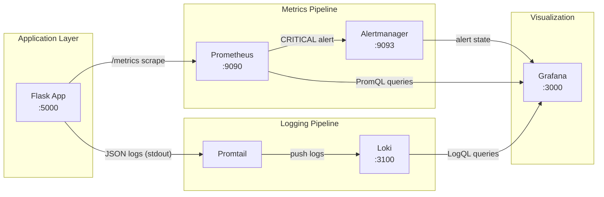

# DevOps Observability Lab

A complete observability stack for a containerized Python application, deployable with a single command. The system collects **metrics** (Prometheus + Grafana), **logs** (Loki + Promtail), and **alerts** (Prometheus rules + Grafana Alerting) using industry-standard tools.

## Quick Start

**Prerequisites:** Docker and Docker Compose installed.

```bash
docker compose up -d --build
```

| Service       | URL                              | Credentials   |
|---------------|----------------------------------|---------------|
| Application   | http://localhost:5000            | —             |
| Prometheus    | http://localhost:9090            | —             |
| Grafana       | http://localhost:3000            | admin / admin |
| Alertmanager  | http://localhost:9093            | —             |
| Loki          | http://localhost:3100            | —             |

Verify the app is healthy:

```bash
curl http://localhost:5000/health
curl http://localhost:5000/metrics
```

Stop the stack:

```bash
docker compose down
```

---

## Architecture Diagram



**Data flow summary:**

1. The Flask app exposes a `/metrics` endpoint with `app_requests_total` and `app_errors_total` counters, and writes structured JSON logs to stdout.
2. **Prometheus** scrapes `/metrics` every 15 seconds and evaluates alert rules.
3. **Promtail** discovers Docker containers via the Docker socket, parses JSON log lines, and ships them to **Loki**.
4. **Grafana** queries Prometheus (metrics) and Loki (logs) and displays dashboards and alert rules.
5. When the error rate exceeds 5/min, **Prometheus** fires a CRITICAL alert routed to **Alertmanager**.

---

## Implementation Details

### Application Instrumentation

The application (`app/main.py`) is a Flask service instrumented with:

- **`app_requests_total`** — Counter labeled by `method`, `endpoint`, and `status`
- **`app_errors_total`** — Counter labeled by `error_type`
- **JSON-structured logging** — Every log line is a single JSON object with `timestamp`, `level`, `message`, `service`, and contextual fields

Key endpoints:

| Endpoint              | Purpose                                      |
|-----------------------|----------------------------------------------|
| `GET /health`         | Health check                                 |
| `GET /api/data`       | Normal traffic (generates INFO logs)         |
| `GET /api/error`      | Simulates a single error (+1 to counter)     |
| `GET /api/error/bulk` | Simulates N errors (`?count=10`)             |
| `GET /metrics`        | Prometheus metrics exposition                |

### Logging Strategy: Loki + Promtail

We chose **Loki + Promtail** over the ELK stack because:

- Loki indexes only **labels** (metadata), not full log content — lower storage and memory footprint
- Promtail integrates natively with Docker via service discovery (`docker_sd_configs`)
- Grafana can query both metrics and logs in one UI (no separate Kibana instance)
- The stack is lighter and faster to deploy for a lab environment

**Pipeline:**

1. App writes JSON to stdout → captured by Docker's logging driver
2. Promtail tails container logs via `/var/run/docker.sock`
3. Promtail parses JSON fields (`level`, `service`, `error_type`) and attaches them as Loki labels
4. Logs are pushed to Loki and queried in Grafana with LogQL: `{container="observability-lab-app"} | json | level="ERROR"`

### Monitoring Strategy: Prometheus + Grafana

- Prometheus scrapes the app every 15s at `/metrics`
- A pre-provisioned Grafana dashboard (**Observability Lab - Application Metrics**) shows request rates, error counts, and a live error log panel
- Grafana datasources (Prometheus + Loki) are auto-provisioned on startup

### Alerting

A **Prometheus recording rule** in `prometheus/alerts.yml` fires when more than 5 errors occur in a 1-minute window:

```yaml
expr: increase(app_errors_total[1m]) > 5
for: 1m
labels:
  severity: critical
```

A matching **Grafana alert rule** is also provisioned so the alert appears in Grafana's Alerting tab.

---

## How to Trigger the CRITICAL Alert

The alert fires when `app_errors_total` increases by more than **5 in 1 minute**, sustained for **1 minute**.

### Option 1 — Bulk endpoint (fastest)

```bash
curl "http://localhost:5000/api/error/bulk?count=10"
```

### Option 2 — Helper script (Windows PowerShell)

```powershell
.\scripts\trigger-alert.ps1
```

### Option 3 — Helper script (Linux/macOS)

```bash
chmod +x scripts/trigger-alert.sh
./scripts/trigger-alert.sh
```

### Option 4 — Manual repeated calls

```bash
for i in $(seq 1 10); do curl -s http://localhost:5000/api/error; done
```

### Verify the alert fired

1. **Prometheus** → http://localhost:9090/alerts — `HighApplicationErrorRate` should show **FIRING** (red)
2. **Grafana** → Alerting → Alert rules — `CRITICAL - High Application Error Rate` should show **Firing**
3. **Alertmanager** → http://localhost:9093 — alert listed under "critical"

> Allow 1–2 minutes after triggering errors for the `for: 1m` evaluation window to complete.

---

## Evidence (Screenshots)

Place your screenshots in the `screenshots/` folder and reference them below.

### 1. Grafana Dashboard — Custom Application Metrics


*Navigate to: Grafana → Dashboards → Observability Lab → **Observability Lab - Application Metrics***

### 2. Log Analysis — Filtered JSON Logs in Grafana (Loki)


*Navigate to: Grafana → Explore → Loki → Query: `{container="observability-lab-app"} | json | level="ERROR"`*

### 3. Grafana Alerting — Active Alert Rule


*Navigate to: Grafana → Alerting → Alert rules → **CRITICAL - High Application Error Rate***

---

## Analysis

### Why is JSON-structured logging more efficient than plain text logs?

Plain text logs are designed for human reading: each line is free-form prose that must be parsed with regular expressions at query time. Regex parsing is slow, brittle (breaks when log format changes), and cannot reliably extract nested or typed fields.

JSON-structured logging writes each event as a **machine-readable object** with fixed keys (`timestamp`, `level`, `message`, `error_type`, etc.). This enables:

- **Instant field extraction** — No regex; tools like Loki's `| json` stage parse fields in O(1) per key
- **Consistent indexing** — Fields become searchable labels/filters without custom parsers
- **Correlation** — Structured fields (e.g., `request_id`, `user_id`) link logs to traces and metrics
- **Lower operational cost** — Automated alerting and dashboards query specific fields directly instead of scanning raw text

In this lab, Promtail's JSON pipeline stage extracts `level` and `error_type` as Loki labels, making `{service="app"} | json | level="ERROR"` a precise, fast filter.

### What is the fundamental technical difference between Prometheus (metrics) and Loki (logging)?

| Aspect            | Prometheus (Metrics)                    | Loki (Logs)                              |
|-------------------|-----------------------------------------|------------------------------------------|
| **Data type**     | Numeric time-series (counters, gauges)  | Discrete text events (log lines)         |
| **Storage model** | Full values stored in time-series DB    | Log content compressed; only **labels** indexed |
| **Query language**| PromQL (aggregations, rates, math)      | LogQL (filter, parse, label extraction)  |
| **Cardinality**   | Low — limited label combinations        | High — millions of unique log lines      |
| **Retention cost**| Low — numeric samples are tiny          | Higher — but Loki mitigates via label-only indexing |
| **Best for**      | Trends, SLIs, alerting on rates         | Debugging, audit trails, error context   |

**Fundamentally:** Prometheus answers *"how much and how fast?"* (aggregated numbers over time). Loki answers *"what exactly happened?"* (individual events with full context). They are complementary — metrics detect the anomaly; logs explain the cause.

### How would you handle long-term log retention (e.g., 6 months) without depleting disk resources?

1. **Retention policies** — Configure Loki's `limits_config.retention_period` (already set to 7 days in this lab) and enable the compactor to automatically delete expired chunks.

2. **Tiered storage** — Hot data (recent 7–30 days) on fast SSD; warm/cold data (1–6 months) offloaded to object storage (S3, GCS, Azure Blob) using Loki's `boltdb-shipper` or TSDB shipper with `object_store: s3`.

3. **Compaction and compression** — Loki compacts small chunks into larger blocks with efficient compression (gzip/snappy), reducing storage by 70–90%.

4. **Label discipline** — Avoid high-cardinality labels (e.g., `user_id`, `request_id`) in Loki; keep them in log content, not the index. This prevents index bloat.

5. **Sampling and filtering** — Drop DEBUG/INFO logs at the Promtail pipeline stage for long-term retention; keep only WARN/ERROR for archival.

6. **Aggregation before archival** — Export daily error summaries to Prometheus or a data warehouse, then delete raw logs older than 30 days.

7. **Monitoring disk usage** — Alert on Loki volume usage and set hard quotas per tenant.

For 6-month retention in production, the typical pattern is: **7 days hot in Loki → 6 months cold in S3 with lifecycle policies → delete after 6 months**.

---

## Project Structure

```
.
├── app/
│   ├── Dockerfile
│   ├── main.py              # Instrumented Flask application
│   └── requirements.txt
├── prometheus/
│   ├── prometheus.yml       # Scrape config
│   └── alerts.yml           # CRITICAL alert rule
├── alertmanager/
│   └── alertmanager.yml
├── loki/
│   └── loki-config.yml
├── promtail/
│   └── promtail-config.yml
├── grafana/
│   ├── dashboards/
│   │   └── app-metrics.json
│   └── provisioning/
│       ├── datasources/
│       ├── dashboards/
│       └── alerting/
├── scripts/
│   ├── trigger-alert.ps1
│   └── trigger-alert.sh
├── screenshots/             # Place evidence screenshots here
├── docker-compose.yml
└── README.md
```

---

## Troubleshooting

| Issue | Solution |
|-------|----------|
| Grafana dashboard empty | Wait 30s for first Prometheus scrape; generate traffic with `curl http://localhost:5000/api/data` |
| No logs in Loki | Confirm Promtail is running: `docker compose logs promtail`; ensure Docker socket is mounted |
| Alert not firing | Errors must exceed 5/min for 1 full minute; use `/api/error/bulk?count=10` |
| Port conflict | Change host ports in `docker-compose.yml` |
