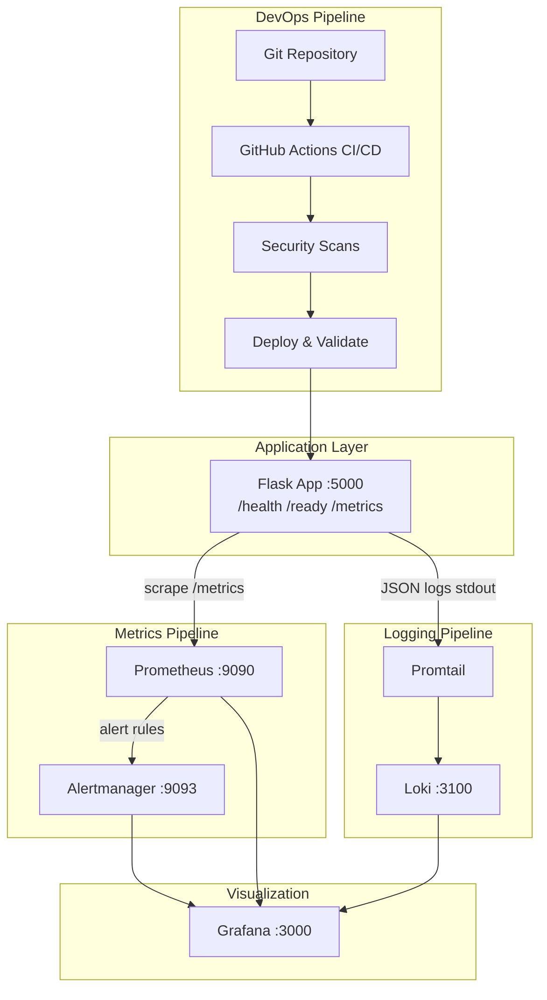
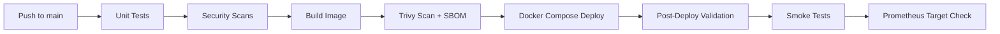
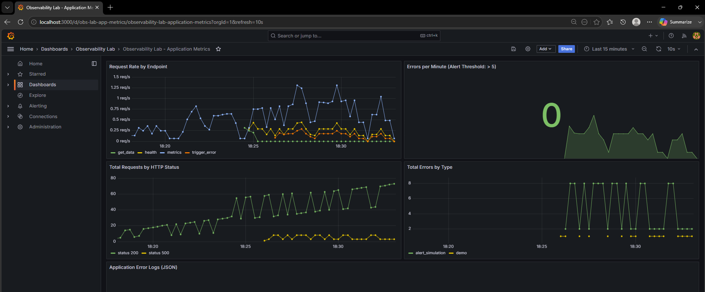
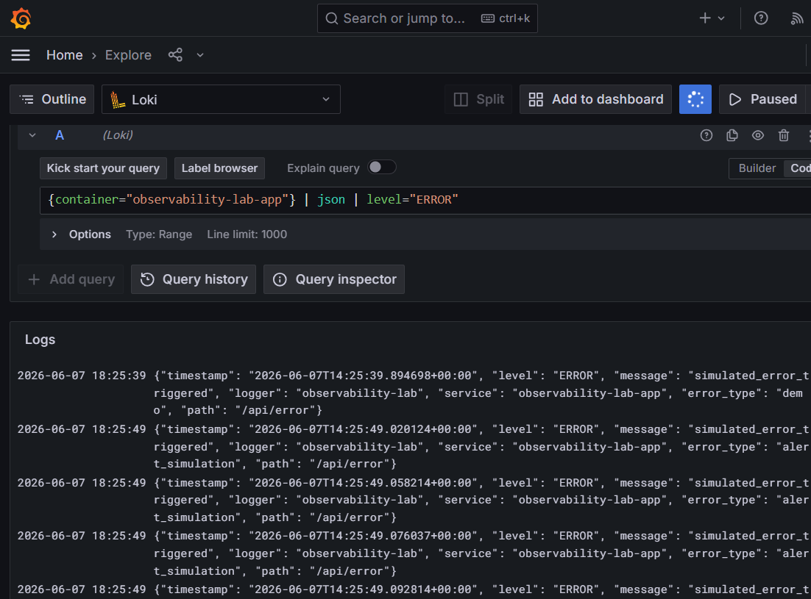
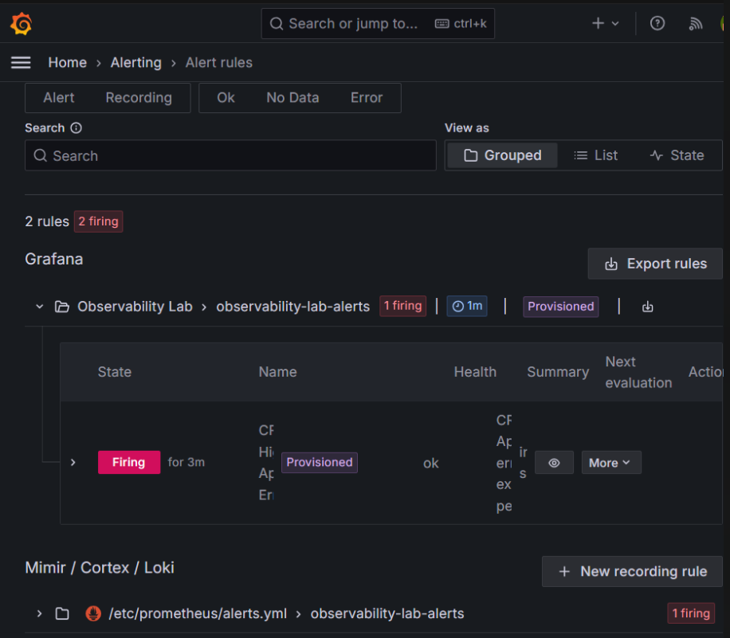
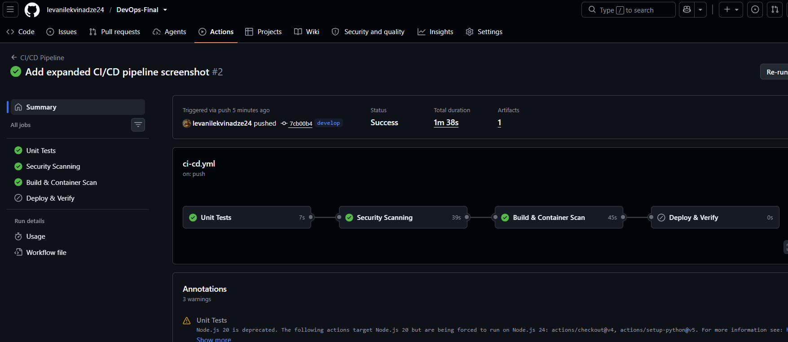
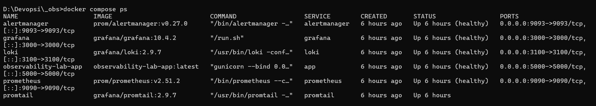
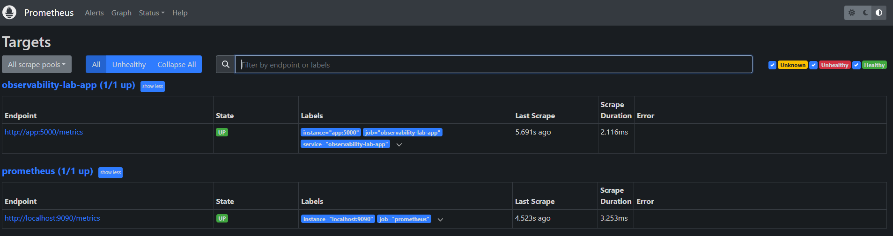

# DevOps Final Project — Observability Lab

A production-oriented DevOps stack built on the semester's assignments: a containerized Python application with **version control**, **CI/CD**, **security automation**, **monitoring**, **logging**, **alerting**, and **reliability** tooling. The full environment starts with a single command and runs entirely locally via Docker Compose (no paid cloud services required).

**Repository:** https://github.com/levanilekvinadze24/DevOps-Final

**Prior assignments integrated:**

| Assignment | Repository | Contribution to final project |
|------------|------------|-------------------------------|
| Assignment 1 | [DevOps-Assigment1](https://github.com/levanilekvinadze24/DevOps-Assigment1) | Git workflow, CI foundations, automated testing |
| Midterm | [DevOps-Midterm](https://github.com/levanilekvinadze24/DevOps-Midterm) | Deployment automation, health monitoring |
| Observability Lab | This repository | Prometheus, Grafana, Loki, Alertmanager, full final stack |

**CI/CD status:** All pipeline jobs pass on `main` — see [GitHub Actions](https://github.com/levanilekvinadze24/DevOps-Final/actions).

---

## Table of Contents

- [Quick Start](#quick-start-single-command)
- [Final Project Requirements Coverage](#final-project-requirements-coverage)
- [Project Architecture](#project-architecture)
- [Version Control & Branching](#version-control--branching)
- [Deployment Workflow](#deployment-workflow)
- [Environment Setup](#environment-setup)
- [Security Implementation](#security-implementation)
- [Monitoring, Logging & Alerting](#monitoring-logging--alerting)
- [Reliability Improvements](#reliability-improvements)
- [CI/CD Pipeline](#cicd-pipeline)
- [Screenshots](#screenshots)
- [Project Structure](#project-structure)
- [For Evaluators](#for-evaluators)
- [Troubleshooting](#troubleshooting)

---

## Quick Start (Single Command)

**Prerequisites:** Docker Desktop with Docker Compose v2.

### Windows (PowerShell)

```powershell
.\scripts\setup.ps1
```

### Linux / macOS

```bash
chmod +x scripts/*.sh
./scripts/setup.sh
```

This script copies `.env.example` → `.env`, builds all containers, starts the stack, and runs automated validation.

| Service       | URL                              | Credentials   |
|---------------|----------------------------------|---------------|
| Application   | http://localhost:5000            | —             |
| Prometheus    | http://localhost:9090            | —             |
| Grafana       | http://localhost:3000            | admin / admin |
| Alertmanager  | http://localhost:9093            | —             |
| Loki          | http://localhost:3100            | —             |

Verify manually:

```bash
curl http://localhost:5000/health
curl http://localhost:5000/ready
curl http://localhost:5000/metrics
```

Stop the stack:

```bash
docker compose down
```

---

## Final Project Requirements Coverage

| Requirement | Implementation | Evidence |
|-------------|----------------|----------|
| **Environment automation** | `scripts/setup.sh` / `setup.ps1` — one command builds and validates the full stack | [scripts/setup.ps1](scripts/setup.ps1), `.env.example` |
| **Security automation** | 7 security checks in CI: Gitleaks, pip-audit, Hadolint, Checkov, compose validation, Trivy, SBOM | [.github/workflows/ci-cd.yml](.github/workflows/ci-cd.yml) |
| **Reliability** | Health checks, SLO alerts, rollback scripts, incident runbook, health monitor | [docs/SLO.md](docs/SLO.md), [docs/INCIDENT_RESPONSE.md](docs/INCIDENT_RESPONSE.md) |
| **Automation improvements** | 4-stage CI/CD with post-deploy validation, smoke tests, Prometheus target check | GitHub Actions (green on `main`) |
| **Documentation** | This README + architecture diagrams + screenshots | `screenshots/` |
| **Local execution** | Entire stack via Docker Compose — no cloud subscription required | `docker compose up` |
| **Prior functionality preserved** | Git, CI/CD, Docker, monitoring, logging, alerting, health checks all operational | See sections below |

---

## Project Architecture



**Components:**

| Layer | Tool | Purpose |
|-------|------|---------|
| Application | Flask + Gunicorn | Instrumented API with Prometheus metrics and JSON logging |
| CI/CD | GitHub Actions | Test → security scan → build → container scan → deploy & verify |
| Metrics | Prometheus | Scrapes `/metrics`, evaluates alert rules and SLOs |
| Logs | Loki + Promtail | Collects structured JSON logs from Docker containers |
| Dashboards | Grafana | Pre-provisioned dashboards, datasources, and alert rules |
| Alerting | Alertmanager | Routes critical/warning alerts by severity |
| IaC | Docker Compose | Declarative multi-service stack with health checks |

---

## Version Control & Branching

**Git** is used for all source control. Infrastructure, application code, CI/CD workflows, and documentation are versioned in this repository.

| Branch | Purpose | CI/CD |
|--------|---------|-------|
| `main` | Production-ready code | Full pipeline + automated deploy verification |
| `develop` | Integration branch | CI + security scans (no deploy) |
| `feature/*` | New features | CI on pull request to `main` |

**Workflow:** `feature/*` → pull request to `main` → CI must pass (tests + security) → merge triggers CD validation on `main`.

---

## Deployment Workflow



### Local deployment

```bash
./scripts/deploy.sh          # Linux/macOS
.\scripts\deploy.ps1         # Windows
```

Deploy tags the current image for rollback, rebuilds the app container, restarts it, and runs validation.

### Rollback

```bash
./scripts/rollback.sh        # Linux/macOS
.\scripts\rollback.ps1       # Windows
```

Rollback retags the previous deployment image and restarts without rebuilding. See [docs/INCIDENT_RESPONSE.md](docs/INCIDENT_RESPONSE.md) for the full recovery runbook.

---

## Environment Setup

1. Clone the repository:
   ```bash
   git clone https://github.com/levanilekvinadze24/DevOps-Final.git
   cd DevOps-Final
   ```
2. Ensure Docker Desktop is running
3. Run `scripts/setup.ps1` (Windows) or `scripts/setup.sh` (Linux/macOS)
4. Optional: edit `.env` (created from `.env.example`) to customize ports and credentials

**Validation:**

```bash
./scripts/validate-environment.sh    # Linux/macOS
.\scripts\validate-environment.ps1 # Windows
```

**Continuous health monitoring:**

```bash
./scripts/health-monitor.sh    # polls /health and /ready every 30s
```

---

## Security Implementation

Security checks are integrated into the CI/CD pipeline (`.github/workflows/ci-cd.yml`) and run on every push and pull request:

| Check | Tool | Scope | When it runs |
|-------|------|-------|--------------|
| Secrets scanning | Gitleaks (Docker) | Entire repository filesystem | Every CI run |
| Dependency vulnerabilities | pip-audit (`--strict`) | `app/requirements.txt` | Every CI run |
| Dockerfile lint | Hadolint | `app/Dockerfile` | Every CI run |
| Compose validation | `docker compose config` | Infrastructure config | Every CI run |
| IaC security | Checkov (`dockerfile`, `yaml`) | Dockerfile + Docker Compose | Every CI run |
| Container image scan | Trivy (`v0.35.0`, CRITICAL/HIGH) | Built application image | Every CI run |
| SBOM generation | Trivy (SPDX JSON) | Built application image | Every CI run (artifact uploaded) |

**Additional hardening:**

- Application runs as non-root user (`appuser`) in the container
- Secrets managed via `.env` file (gitignored); template in `.env.example`
- Grafana signup disabled; admin credentials via environment variables
- Read-only volume mounts for Prometheus, Alertmanager, and Grafana provisioning
- Pinned dependency versions in `app/requirements.txt` (Flask 3.1.3, Gunicorn 23.0.0)

**Run security checks locally:**

```bash
make security    # compose validation + pip-audit
make lint        # Dockerfile lint via Hadolint container
docker run --rm -v "$(pwd):/repo" zricethezav/gitleaks:latest detect --source=/repo --no-git
```

---

## Monitoring, Logging & Alerting

### Metrics (Prometheus + Grafana)

- `app_requests_total` — counter by method, endpoint, status
- `app_errors_total` — counter by error type
- Pre-provisioned Grafana dashboard: **Observability Lab - Application Metrics**

### Logs (Loki + Promtail)

Structured JSON logs with fields: `timestamp`, `level`, `message`, `service`, `duration_ms`.

LogQL example:

```logql
{container="observability-lab-app"} | json | level="ERROR"
```

### Alert rules

| Alert | Severity | Condition |
|-------|----------|-----------|
| `HighApplicationErrorRate` | critical | >5 errors/min for 1 min |
| `ApplicationDown` | critical | Prometheus scrape target down |
| `HighErrorRateWarning` | warning | >10 errors in 5 min |
| `SLOAvailabilityBreach` | warning | Success rate <99% for 5 min |

**Trigger the critical alert:**

```bash
./scripts/trigger-alert.sh
# or
curl "http://localhost:5000/api/error/bulk?count=10"
```

**Verify at:**

- Prometheus alerts: http://localhost:9090/alerts
- Grafana alerting: http://localhost:3000/alerting/list
- Alertmanager: http://localhost:9093

---

## Reliability Improvements

| Improvement | Implementation |
|-------------|----------------|
| Health checks | Docker Compose healthchecks on all services; `/health` and `/ready` endpoints |
| SLO monitoring | 99% availability target with Prometheus alert — see [docs/SLO.md](docs/SLO.md) |
| Rollback procedure | `scripts/rollback.sh` / `rollback.ps1` retags the previous deployment image and restarts without rebuilding |
| Failure recovery | Automated restart (`restart: unless-stopped`), setup script for full stack recovery |
| Incident response | [docs/INCIDENT_RESPONSE.md](docs/INCIDENT_RESPONSE.md) runbook with P1/P2 severity levels |
| Service monitoring | `scripts/health-monitor.sh` continuous polling with failure alerting |
| Tiered alerting | Critical vs warning routes in Alertmanager with inhibition rules |
| Post-deploy verification | Automated validation of all 6 services + smoke tests + Prometheus scrape check in CI |

---

## CI/CD Pipeline

Defined in `.github/workflows/ci-cd.yml`. Triggered on push to `main`/`develop` and on pull requests to `main`.

| Job | Steps | Runs on |
|-----|-------|---------|
| **Unit Tests** | Install deps, run pytest (7 tests) | All branches |
| **Security Scanning** | Gitleaks, pip-audit, Hadolint, compose config, Checkov | All branches |
| **Build & Container Scan** | Docker build, Trivy scan (CRITICAL/HIGH), SBOM upload | All branches |
| **Deploy & Verify** | Full stack deploy, validation, smoke tests, Prometheus check, tear down | `main` push only |

**Post-deployment checks (CI):**

1. All services healthy (app, Prometheus, Alertmanager, Grafana, Loki)
2. Smoke test: `/health`, `/ready`, `/api/data`, `/metrics`
3. Prometheus scrape target reports `"health":"up"`

---

## API Endpoints

| Endpoint | Method | Description |
|----------|--------|-------------|
| `/` | GET | Service info |
| `/health` | GET | Liveness probe |
| `/ready` | GET | Readiness probe |
| `/api/data` | GET | Normal traffic (generates metrics + logs) |
| `/api/error` | GET | Single simulated error |
| `/api/error/bulk` | GET | Bulk errors (`?count=10`) |
| `/metrics` | GET | Prometheus metrics |

---

## Screenshots

Evidence of implemented functionality (see `screenshots/`):

### Grafana Dashboard — Monitoring



*Grafana → Dashboards → Observability Lab → Application Metrics. Shows request rate, errors/min, HTTP status codes, and error types.*

### Log Analysis — Logging (Loki)



*Grafana → Explore → Loki query: `{container="observability-lab-app"} | json | level="ERROR"`. Structured JSON error logs from the application.*

### Alerting



*Grafana → Alerting → Alert rules firing. Demonstrates critical alert `HighApplicationErrorRate` triggered by simulated errors.*

### CI/CD Pipeline



*GitHub Actions → CI/CD Pipeline #10 — all 4 jobs passing: Unit Tests, Security Scanning, Build & Container Scan, Deploy & Verify.*

### Additional Evidence

#### Docker Compose — All Services Healthy



*`docker compose ps` — all 6 services running; app, Prometheus, Grafana, Loki, and Alertmanager report healthy.*

#### Prometheus Targets — Metrics Scraping



*Prometheus → Status → Targets — `observability-lab-app` scrape target UP at `http://app:5000/metrics`.*

---

## Project Structure

```
.
├── .github/workflows/
│   └── ci-cd.yml              # CI/CD pipeline with security + deploy
├── app/
│   ├── Dockerfile             # Hardened non-root container
│   ├── main.py                # Instrumented Flask application
│   ├── requirements.txt
│   └── tests/                 # Unit tests (pytest)
├── prometheus/
│   ├── prometheus.yml
│   └── alerts.yml             # Critical, warning, and SLO alerts
├── alertmanager/
│   └── alertmanager.yml       # Severity-based routing
├── loki/  promtail/  grafana/
├── scripts/
│   ├── setup.sh / setup.ps1           # One-command environment setup
│   ├── validate-environment.*         # Post-deploy validation
│   ├── deploy.* / rollback.*          # Deployment automation
│   ├── health-monitor.*               # Continuous health polling
│   └── trigger-alert.*                # Alert simulation
├── docs/
│   ├── INCIDENT_RESPONSE.md
│   └── SLO.md
├── screenshots/               # Evidence screenshots
├── docker-compose.yml         # Full stack with health checks
├── .env.example
├── .checkov.yml
├── Makefile
└── README.md
```

---

## For Evaluators

**Quick evaluation (≈5 minutes):**

1. Clone repo and run `.\scripts\setup.ps1` (Windows) or `./scripts/setup.sh` (Linux/macOS)
2. Open http://localhost:5000/health — should return `{"status":"healthy"}`
3. Open http://localhost:3000 — Grafana dashboard (admin/admin)
4. Check CI: https://github.com/levanilekvinadze24/DevOps-Final/actions — all jobs green on latest `main` run
5. Review screenshots in `screenshots/` and security docs above

**No paid services required.** Everything runs locally via Docker Compose.

---

## Troubleshooting

| Issue | Solution |
|-------|----------|
| Setup fails health check | Wait 60s; run `docker compose ps` and `docker compose logs app` |
| Grafana dashboard empty | Generate traffic: `curl http://localhost:5000/api/data` |
| No logs in Loki | Check Promtail: `docker compose logs promtail` |
| Alert not firing | Use `/api/error/bulk?count=10`; wait 1–2 min for `for:` window |
| CI Checkov fails | Run `docker compose config` locally; fix reported misconfigurations |
| Port conflict | Change `APP_PORT` in `.env` |

---

## License

Academic project — DevOps course final submission.
